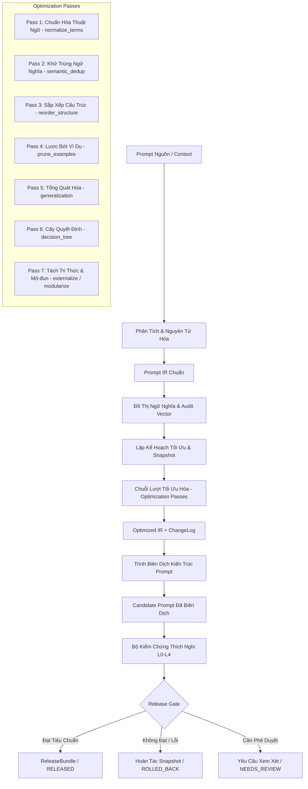

# Kỹ Năng Biên Dịch & Tối Ưu Hóa Prompt (V4.1 Portable Agent Skill)

Một portable Agent Skill theo mô hình "chuỗi công cụ kiểu trình biên dịch" (compiler toolchain) giúp phân tích, chuẩn hóa sang Biểu Diễn Trung Gian (IR), tối ưu hóa có kiểm soát rủi ro, biên dịch kiến trúc và kiểm chứng thích nghi theo quyền truy cập hệ thống.

---

## 1. Nguyên Tắc Cốt Lõi

1. **Không tối ưu chỉ vì prompt dài**: Chỉ chấp nhận thay đổi khi giảm độ phức tạp logic hoặc token mà vẫn bảo toàn 100% hành vi cốt lõi và không làm sai ranh giới quyết định.
2. **Quyền kết luận `KEEP`**: Nếu prompt đã tối ưu, ít xung đột, nằm trong ngân sách token, hệ thống giữ nguyên prompt gốc và xuất báo cáo audit thay vì cố nén.
3. **Bảo toàn Invariants**: Mọi quy tắc và ngoại lệ bắt buộc phải được bảo toàn xuyên suốt các lượt tối ưu.
4. **Kiểm chứng thích nghi theo bằng chứng (L0–L4)**: Không phụ thuộc vào việc có gọi được API thật hay không. Hệ thống tự chọn tầng kiểm thử phù hợp nhất từ L0 (Static) đến L4 (E2E) và ghi rõ `verification_debt`.

---

## 2. Kiến Trúc Tuyến Xử Lý (Compiler Pipeline)



---

## 3. Khung Quyết Định Tối Ưu (Decision Tiers)

| Quyết Định | Điều Kiện Điển Hình | Hành Động Được Phép |
| :--- | :--- | :--- |
| **`KEEP`** | Token trong ngân sách, cấu trúc rõ, không dư thừa/xung đột | Không biến đổi; chỉ xuất báo cáo audit |
| **`LIGHT`** | Thuật ngữ trùng, diễn đạt lặp, ngữ nghĩa ổn định | Chuẩn hóa thuật ngữ + Khử trùng ngữ nghĩa an toàn |
| **`STRUCTURAL`** | Logic tốt nhưng thứ bậc/luồng nhận thức khó hiểu | Sắp xếp lại cấu trúc + Quy trình quyết định + Tách hợp đồng đầu ra |
| **`MAJOR`** | Chồng lấn, xung đột chính sách, logic phụ thuộc ví dụ | Đồ thị ngữ nghĩa + Tổng quát hóa / Cây quyết định có kiểm chứng |
| **`EXTERNALIZE`** | Khối tri thức lớn/hay đổi, có cơ chế truy xuất (RAG/docs) | Tách tri thức ra tệp tham chiếu / RAG payload |
| **`MODULARIZE`** | Prompt rất lớn, nhiều miền nghiệp vụ độc lập | Tách phần cốt lõi (Core) + Mô-đun điều kiện nạp khi chạy (Runtime) |

---

## 4. Tầng Kiểm Chứng Thích Nghi (Adaptive Verification L0–L4)

- **L0 (Static Verification)**: Kiểm tra lược đồ IR, độ phủ quy tắc 100%, hợp đồng đầu ra, phát hiện xung đột không cần gọi model.
- **L1 (Differential / Offline Testing)**: So sánh hành vi đầu ra giữa prompt gốc và prompt ứng viên trên cùng bộ câu hỏi.
- **L2 (Contract Verification)**: Kiểm tra cấu trúc JSON schema, tool name, arguments, enum, required fields mà không execute backend.
- **L3 (Mock Replay)**: Kiểm tra luồng hội thoại / multi-turn bằng dependency giả lập (mock responses).
- **L4 (End-to-End Testing)**: Kiểm thử toàn diện trên môi trường tích hợp thật khi được cấp quyền.

---

## 5. Cổng Kiểm Duyệt Phát Hành (Release Gate)

Bản ứng viên được phát hành (**`PASS`**) khi và chỉ khi:
1. `unresolved_critical_conflicts == 0` (0 xung đột nghiêm trọng chưa giải quyết).
2. `required_invariant_coverage == 100%` (100% bất biến bắt buộc được bảo toàn).
3. `critical_regressions == 0` (0 lỗi hồi quy nghiêm trọng).
4. `output_contract_preserved == true` (Hợp đồng đầu ra được giữ nguyên vẹn).
5. `token_budget_ok == true` (Không vượt ngân sách token đã định).

---

## 6. Hướng Dẫn Sử Dụng (CLI & Cargo Integration)

### Chạy toàn bộ pipeline tối ưu hóa:
```bash
cargo run --bin run_pipeline -- --input <path-to-prompt.md> --output-dir ./artifacts --profile gpt-4o
```

### Kiểm tra tính hợp lệ của IR & Bất biến:
```bash
cargo run --bin ir_validator -- --ir ./artifacts/prompt_ir.json
```

### Phân tích đồ thị quan hệ ngữ nghĩa & xung đột:
```bash
cargo run --bin graph_analyzer -- --ir ./artifacts/prompt_ir.json
```

### Đo lường chỉ số token & độ phức tạp:
```bash
cargo run --bin prompt_metrics -- --file <prompt.md>
```

### Kiểm tra bảo toàn bất biến trước phát hành:
```bash
cargo run --bin invariant_checker -- --original-ir ./artifacts/prompt_ir.json --optimized-ir ./artifacts/optimized_ir.json
```

### Chạy bộ kiểm thử hồi quy:
```bash
cargo run --bin regression_runner -- --original <baseline.md> --optimized ./artifacts/candidate.prompt.md
```

### Chạy Unit Test kiểm thử hệ thống:
```bash
cargo test
```
