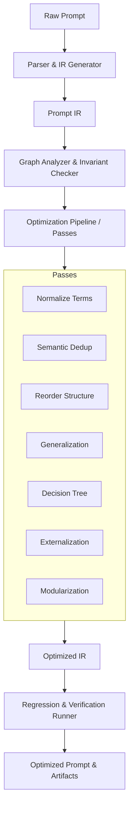

# Prompt Compiler & Optimizer Skill

A compiler-inspired framework and pipeline to parse, analyze, optimize, and verify LLM system prompts and instructions.

## Architecture & Workflow



## Directory Structure
- `scripts/`: Core execution scripts, validation tools, graph analyzers, metric calculators, and compilation passes.
  - `passes/`: Individual optimization passes (term normalization, deduplication, tree refactoring, modularization, etc.).
- `schemas/`: JSON schemas for Prompt IR, Atomic Rules, Semantic Graph, Optimization Plans, and Verification Reports.
- `prompts/`: Few-shot LLM guidance prompts for parsing, relation classification, generalization, and test synthesis.
- `references/`: Detailed specifications on IR format, pass designs, target model profiles, verification protocols, and release policies.
- `adapters/`: Host execution contracts and runtime integration specs.
- `tests/`: Automated unit and integration tests for the compilation pipeline.

## Usage Guide
Run the main optimization pipeline:
```bash
cargo run --bin run_pipeline -- --input <path-to-prompt.md> --output-dir ./artifacts --profile gpt-4o
```
Validate IR against schema:
```bash
cargo run --bin ir_validator -- --ir ./artifacts/prompt_ir.json
```
Run regression & invariant checks:
```bash
cargo run --bin regression_runner -- --original <prompt.md> --optimized ./artifacts/optimized_prompt.md
```
Run tests:
```bash
cargo test
```
