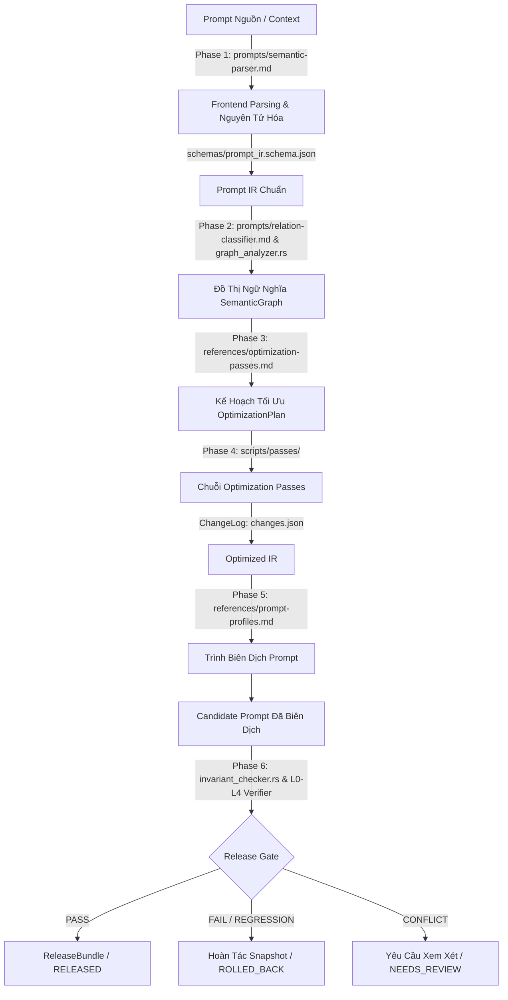

# Kỹ Năng Biên Dịch & Tối Ưu Hóa Prompt (V4.1 Portable Agent Skill)

Một portable Agent Skill theo mô hình "chuỗi công cụ kiểu trình biên dịch" (compiler toolchain) giúp phân tích, chuẩn hóa sang Biểu Diễn Trung Gian (IR), tối ưu hóa có kiểm soát rủi ro, biên dịch kiến trúc và kiểm chứng thích nghi theo quyền truy cập hệ thống.

---

## 1. Nguyên Tắc Cốt Lõi (Core Principles)

1. **Không tối ưu chỉ vì prompt dài**: Chỉ chấp nhận thay đổi khi giảm độ phức tạp logic hoặc token mà vẫn bảo toàn 100% hành vi cốt lõi và không làm sai ranh giới quyết định.
2. **Quyền kết luận `KEEP`**: Nếu prompt đã tối ưu, ít xung đột, nằm trong ngân sách token, hệ thống giữ nguyên prompt gốc và xuất báo cáo audit thay vì cố nén.
3. **Bảo toàn Invariants (INV-01 đến INV-09)**: Mọi quy tắc, ngoại lệ và toàn bộ các ví dụ minh họa bắt buộc phải được bảo toàn xuyên suốt các lượt tối ưu (Xem chi tiết tại `references/ir-spec.md`).
4. **Bảo toàn 100% Ví dụ (Full Example Preservation - Zero Loss)**: Mọi ví dụ trong prompt gốc (few-shot examples, JSON shorthand payloads, mẫu hội thoại, mẫu bảng/biểu đồ, ví dụ xử lý tình huống) BẮT BUỘC phải được giữ lại đầy đủ 100%. Quá trình tối ưu chỉ tái cấu trúc và khử trùng lặp câu chữ mô tả, TUYỆT ĐỐI KHÔNG được xóa bỏ, cắt bớt hay làm mất ví dụ.
5. **Kiểm chứng thích nghi theo bằng chứng (L0–L4)**: Không phụ thuộc vào việc có gọi được API thật hay không. Hệ thống tự chọn tầng kiểm thử phù hợp nhất từ L0 (Static) đến L4 (E2E) và ghi rõ `verification_debt`.

---

## 2. Bản Đồ Cấu Trúc Tài Nguyên (Skill Resource Registry)

Skill được tổ chức phân lớp rõ ràng giữa **Nhận thức LLM (Cognitive Prompts)**, **Đặc tả tri thức (References)**, **Chuẩn hóa dữ liệu (Schemas)** và **Engine thực thi tất định (Rust Engine)** theo đường dẫn tương đối (Relative Paths) đảm bảo tính linh hoạt và chuyển giao đa nền tảng:

| Thư mục / Thành phần | Tệp tin tương đối | Vai trò & Mục đích sử dụng |
| :--- | :--- | :--- |
| **`prompts/`** *(LLM Sub-prompts)* | `prompts/semantic-parser.md`<br>`prompts/relation-classifier.md`<br>`prompts/generalizer.md`<br>`prompts/test-generator.md`<br>`prompts/test-interpreter.md` | Các chỉ dẫn chuẩn cho Sub-agent/LLM khi đóng vai trò Frontend Parser, phân loại quan hệ ngữ nghĩa, tổng quát hóa quy tắc và sinh test case kiểm chứng. |
| **`references/`** *(Knowledge Base)* | `references/ir-spec.md`<br>`references/optimization-passes.md`<br>`references/release-policy.md`<br>`references/verification.md`<br>`references/prompt-profiles.md` | Bộ đặc tả tiêu chuẩn (Specification): 9 Invariants cốt lõi, ma trận rủi ro từng pass, chính sách Release Gate và hồ sơ kiến trúc cho từng mô hình LLM đích. |
| **`schemas/`** *(JSON Schemas)* | `schemas/prompt_ir.schema.json`<br>`schemas/atomic_rule.schema.json`<br>`schemas/semantic_graph.schema.json`<br>`schemas/optimization_plan.schema.json`<br>`schemas/verification_report.schema.json` | Lược đồ JSON ràng buộc kiểu dữ liệu cho toàn bộ các artifacts trao đổi giữa các tầng trong compiler pipeline. |
| **`scripts/`** *(Deterministic Engine)* | `scripts/types.rs`<br>`scripts/run_pipeline.rs`<br>`scripts/graph_analyzer.rs`<br>`scripts/ir_validator.rs`<br>`scripts/invariant_checker.rs`<br>`scripts/prompt_metrics.rs`<br>`scripts/regression_runner.rs` | Mã nguồn Rust thực thi tính toán tất định: xác thực cấu trúc, phân tích đồ thị, đo đạc token metrics và kiểm chứng bất biến. |
| **`scripts/passes/`** *(Optimization Passes)* | `scripts/passes/normalize_terms.rs`<br>`scripts/passes/semantic_dedup.rs`<br>`scripts/passes/reorder_structure.rs`<br>`scripts/passes/preserve_and_structure_examples.rs`<br>`scripts/passes/generalization.rs`<br>`scripts/passes/decision_tree.rs`<br>`scripts/passes/modularization.rs`<br>`scripts/passes/externalization.rs` | Các thuật toán biến đổi IR chuyên biệt: chuẩn hóa từ đồng nghĩa, khử trùng lặp ngữ nghĩa, sắp xếp lại thứ tự ưu tiên, bảo toàn & cấu trúc hóa ví dụ. |
| **`adapters/`** *(Host Contract)* | `adapters/host-contract.md` | Giao diện tương thích cho môi trường Agent runner bên ngoài (LangChain, LlamaIndex, Semantic Kernel). |

---

## 3. Quy Trình Tuyến Tính Chi Tiết (End-to-End Pipeline Workflow)



### 📍 Phase 1: Tiếp Nhận & Nguyên Tử Hóa (Ingestion & Semantic Parsing)
- **Mục đích**: Bóc tách toàn bộ văn bản prompt thô thành các đơn vị ý nghĩa (`SemanticUnit`) và quy tắc nguyên tử (`AtomicRule`) độc lập, bảo toàn trọn vẹn 100% các khối ví dụ (`example`).
- **Tài nguyên sử dụng**:
  - **Cognitive Prompt**: Đọc và áp dụng hướng dẫn trích xuất tại `prompts/semantic-parser.md`.
  - **Đặc tả & Schema**: Đối chiếu `references/ir-spec.md` và `schemas/prompt_ir.schema.json`.
  - **Rust Structs**: `PromptIR`, `Section`, `SemanticUnit`, `AtomicRule`, `SourceSpan` trong `scripts/types.rs`.
- **Artifact đầu ra**: `./artifacts/prompt_ir.json` (Đảm bảo 100% bảo toàn vị trí nguồn gốc `INV-01` và toàn bộ ví dụ `INV-09`).

### 📍 Phase 2: Phân Tích Đồ Thị Ngữ Nghĩa (Semantic Graph Analysis)
- **Mục đích**: Xây dựng mạng lưới quan hệ giữa các quy tắc để phát hiện trùng lặp (`same_as`), đối kháng (`conflicts_with`), bao hàm (`subsumes`) hoặc ngoại lệ (`exception_to`).
- **Tài nguyên sử dụng**:
  - **Cognitive Prompt**: `prompts/relation-classifier.md` để phân loại quan hệ logic phức tạp.
  - **Rust Tool**: Hàm `analyze_graph(ir_path: &Path)` trong `scripts/graph_analyzer.rs`.
  - **Schema**: `schemas/semantic_graph.schema.json` & Structs `SemanticGraph`, `GraphNode`, `GraphEdge` trong `scripts/types.rs`.
- **Artifact đầu ra**: `./artifacts/semantic_graph.json`.

### 📍 Phase 3: Lập Kế Hoạch Tối Ưu (Optimization Planning)
- **Mục đích**: Phân loại mức độ can thiệp theo khung quyết định và lập danh sách các passes cần chạy.
- **Khung Quyết Định Tiers**:
  | Quyết Định | Điều Kiện Điển Hình | Hành Động Kích Hoạt |
  | :--- | :--- | :--- |
  | **`KEEP`** | Token trong ngân sách, cấu trúc rõ, không dư thừa/xung đột | Không biến đổi; xuất báo cáo audit |
  | **`LIGHT`** | Thuật ngữ trùng, diễn đạt lặp, ngữ nghĩa ổn định | Chuẩn hóa thuật ngữ + Khử trùng ngữ nghĩa an toàn |
  | **`STRUCTURAL`** | Logic tốt nhưng thứ bậc/luồng nhận thức khó hiểu | Sắp xếp lại cấu trúc + Cây quyết định |
  | **`MAJOR`** | Chồng lấn, xung đột chính sách, cấu trúc phức tạp | Đồ thị ngữ nghĩa + Tổng quát hóa (Bảo toàn 100% ví dụ) |
  | **`EXTERNALIZE`** | Khối tri thức lớn/hay đổi, có cơ chế truy xuất | Tách tri thức ra tệp tham chiếu / RAG payload |
  | **`MODULARIZE`** | Prompt rất lớn, nhiều miền nghiệp vụ độc lập | Tách Core Prompt + Modules nạp runtime |
- **Tài nguyên tham chiếu**: `references/optimization-passes.md`.
- **Artifact đầu ra**: `./artifacts/optimization_plan.json`.

### 📍 Phase 4: Thực Thi Chuỗi Optimization Passes (Pass Execution Engine)
- **Mục đích**: Chạy tuần tự các thuật toán biến đổi IR từ mức rủi ro thấp đến cao. Mọi hành động gộp, sửa, xóa đều phải ghi vào `ChangeLogEntry` (bảo toàn `INV-02`).
- **Chi tiết các hàm thực thi trong `scripts/passes/`**:
  1. **Chuẩn hóa thuật ngữ**: `normalize_terms::run_pass(ir: PromptIR, dict: Option<HashMap<String, String>>) -> (PromptIR, Vec<ChangeLogEntry>)`
  2. **Khử trùng lặp ngữ nghĩa**: `semantic_dedup::run_pass(ir: PromptIR) -> (PromptIR, Vec<ChangeLogEntry>)`
  3. **Sắp xếp lại cấu trúc**: `reorder_structure::run_pass(ir: PromptIR) -> (PromptIR, Vec<ChangeLogEntry>)`
  4. **Bảo toàn & cấu trúc hóa ví dụ**: `preserve_and_structure_examples::run_pass(ir: PromptIR, config) -> (PromptIR, Vec<ChangeLogEntry>)` (Bảo toàn 100% ví dụ mẫu)
  5. **Tổng quát hóa quy tắc**: `generalization::run_pass(ir: PromptIR)` (kết hợp với `prompts/generalizer.md`, bảo toàn ví dụ)
  6. **Cây quyết định**: `decision_tree::run_pass(ir: PromptIR)`
  7. **Tách mô-đun / tri thức**: `modularization::run_pass` & `externalization::run_pass`
- **Artifacts đầu ra**: `./artifacts/optimized_ir.json` và `./artifacts/changes.json`.

### 📍 Phase 5: Biên Dịch Prompt Ứng Viên (Candidate Compilation)
- **Mục đích**: Render cấu trúc IR tối ưu hóa thành định dạng Prompt Markdown theo đúng hồ sơ (Profile) của mô hình đích, đảm bảo toàn bộ khối ví dụ được render đầy đủ.
- **Tài nguyên sử dụng**:
  - **Model Profiles**: `references/prompt-profiles.md` (gpt-4o, claude-3-5-sonnet, gemini-1-5-pro, local-llm).
  - **Compilation Engine**: Logic render kiến trúc tại Phase 5 của `scripts/run_pipeline.rs`.
- **Artifact đầu ra**: `./artifacts/candidate.prompt.md`.

### 📍 Phase 6: Kiểm Chứng Thích Nghi & Cổng Phát Hành (Verification & Release Gate)
- **Mục đích**: Đánh giá toàn diện chất lượng prompt ứng viên qua các tầng L0–L4 và quyết định nghiệm thu.
- **Các tầng kiểm chứng**:
  - **L0 (Static)**: Chạy `scripts/ir_validator.rs` & `scripts/invariant_checker.rs`.
  - **L1 (Differential)**: Chạy `scripts/regression_runner.rs`.
  - **L2 (Contract)**: Kiểm tra JSON Schema, tool signature, output contract (`INV-04`).
  - **L3 / L4 (Mock / E2E)**: Sinh bộ test qua `prompts/test-generator.md` và đánh giá qua `prompts/test-interpreter.md`.
- **Tiêu chuẩn Release Gate (`PASS`)**:
  1. `unresolved_critical_conflicts == 0`
  2. `required_invariant_coverage == 100%`
  3. `example_preservation_rate == 100%` (Bảo toàn 100% ví dụ gốc)
  4. `critical_regressions == 0`
  5. `output_contract_preserved == true`
  6. `token_budget_ok == true`
- **Tài nguyên tham chiếu**: `references/release-policy.md` & `references/verification.md`.
- **Artifact đầu ra**: `./artifacts/verification.json`.

---

## 4. Hướng Dẫn Sử Dụng (CLI & Cargo Integration)

### Chạy toàn bộ pipeline tự động:
```bash
cargo run --bin run_pipeline -- --input <path-to-prompt.md> --output-dir ./artifacts --profile gpt-4o
```

### Chạy từng công cụ kiểm tra độc lập:
- **Kiểm tra tính hợp lệ IR & Invariants**:
  ```bash
  cargo run --bin ir_validator -- --ir ./artifacts/prompt_ir.json
  ```
- **Xây dựng và phân tích đồ thị ngữ nghĩa**:
  ```bash
  cargo run --bin graph_analyzer -- --ir ./artifacts/prompt_ir.json
  ```
- **Đo lường chỉ số Token & Độ phức tạp**:
  ```bash
  cargo run --bin prompt_metrics -- --file <path-to-prompt.md>
  ```
- **Kiểm tra đối chiếu bảo toàn bất biến trước phát hành**:
  ```bash
  cargo run --bin invariant_checker -- --original-ir ./artifacts/prompt_ir.json --optimized-ir ./artifacts/optimized_ir.json
  ```
- **Chạy kiểm thử hồi quy vi sai (Differential Test)**:
  ```bash
  cargo run --bin regression_runner -- --original <baseline.md> --optimized ./artifacts/candidate.prompt.md
  ```
- **Chạy toàn bộ Unit Tests của thư viện**:
  ```bash
  cargo test
  ```
